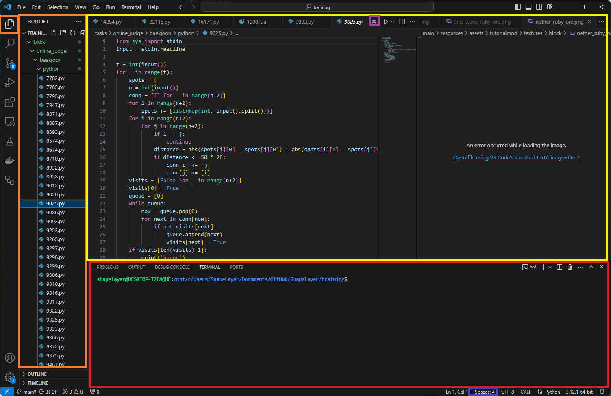

# 필요 프로그램 설치

## 파이썬

https://www.python.org/

<aside>
💡 주의! 설치할 때 `Add Python3.X to path` 체크박스 꼭 체크하세요!

</aside>

## 닷넷 SDK

https://dotnet.microsoft.com/ko-kr/download

## Visual Studio Code

https://code.visualstudio.com/

  

- 빨간색 범위: 터미널
- 주황색 범위: (폴더를 열었을 때) 폴더 내 파일 목록
- 노란색 범위: 코드 편집기
- 유용한 기능
    - 파란색: 들여쓰기의 구현 방법 (화면의 경우 “Spaces: 4”, 공백 4칸으로 구현)
    - 보라색: 파일이 저장되어있지 않으면 닫기 버튼이 X가 아닌 ● 로 표시됨
